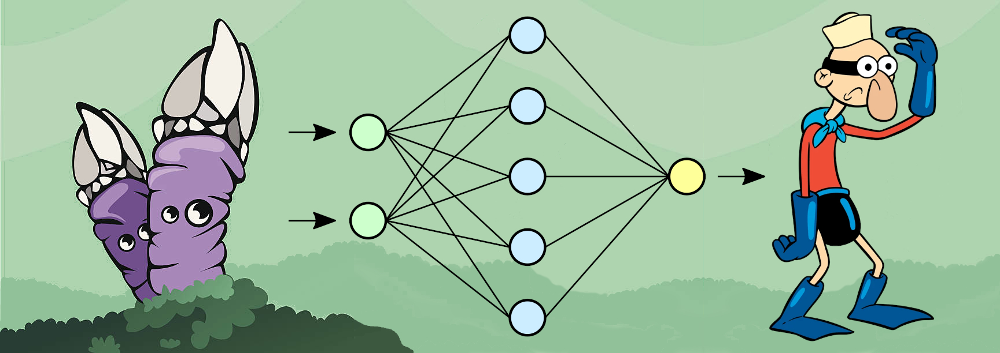

[](https://www.python.org/)
[](https://www.pygame.org/news)


<div style="text-align:left"></div>


# The Barnacle Neuron
### Basic implementation of a Neural Network from scratch

## Table of Contents

- [About this Project](#about-this-project)
    - [Detailed Description](#detailed-description)
    - [Dataset Creation](#dataset-creation)
    - [Neural Network](#neural-network)
    - [Basic Layers](#basic-layers)
    - [MNIST/LETTERS + Training + Result](#entrenamiento)
    - [Interface](#interfaz-grafica)

    
- [Getting Started](#getting-started)
    - [Installation](#installation)
    - [Usage](#usage)

- [Contact](#contact)

## About This Project

### Detailed Description
We aim to create a complete project from scratch, including the creation of the dataset, the implementation and mathematical derivation of the neural network and the creation of a graphical interface to test the results.

### Dataset Creation
To create the dataset, we've made a pygame interface that allows us to draw letters and numbers and save them as images. 
In order to achive translation, rotation and scaling invariance, we've used data augmentation techniques to expand the dataset.

### Neural Network
We are going to use a modular approach to create the NeuralNetwork class. In our implementation, every single operation in the network will be its own Layer. This will simplify the implementation as well as the mathematical derivation of the formulas. Each layer will be able to do two main operations:  

1. **Forward Propagation**: Receives an input from the previous layer, performs the desired operation on it and returs the ouput.  
The first layer will recieve the input from the dataset or from a user provided input.

2. **Backward Propagation**: Recieves the imputed error of the following layer. That is, the error with respect to its input.  
The exception is the last layer, which will be a Loss Layer. It will calculate the imputed error using the loss function and the output of the network.

### Basic Layers
The Layer class will be the base class for the other layers. We will define 3 type of layers for this project: Dense, Activation and Loss layers.

Now we proceed to define the formulas needed in forward and backward propagation for each layer.  

#### Notation:
- $\bar{X}$: Dataset input (matrix)
- $\bar{Y}$: Dataset output (matrix)

- $\textbf{x}$: Input of the network (vector)
- $\textbf{y}$: Output of the network (vector)

- $\bar{x}$: Input of the layer (vector)
- $\bar{y}$: Output of the layer (vector)

- $\bar{W}$: Weights of the Dense layer (matrix)
- $\bar{b}$: Bias of the Dense layer (vector)
- $\bar{a}(\bar{x})$: Activation function of the layer (vector)

- $n$: length of $\bar{x}$
- $m$: length of $\bar{y}$

<br>

We will take advantage of the modular approach of the neural network to define the formulas for each layer. 
 
Using the chain rule, we will be able to derive the formulas for each layer in terms of the formulas of the previous layer.

1. **Dense Layer**

    - **Forward Propagation**:

        ```math
        \begin{equation}
        y_i = 
        w_{i1}x_1 + w_{i2}x_2 + \cdots + w_{in}x_n + b_i = 
        \sum_{j}w_{ij}x_j + b_i
        \end{equation}
        ```

        ```math
        \begin{equation}
        \bar{y} = \bar{W}\bar{x} + \bar{b}
        \end{equation}
        ```
        

    - **Backward Propagation**:   
        - **Parameter update**:
            For each weight $w_{ij}$, we have to calculate the partial derivative of the error with respect to that weight. Using the chain rule, we have:
            $$\frac{\partial{E}}{\partial{w_{ij}}} = \frac{\partial{E}}{\partial{\bar{y_i}}} \frac{\partial{\bar{y_i}}}{\partial{w_{ij}}} = \frac{\partial{E}}{\partial{\bar{y_i}}}\bar{x_j}$$
            And for each bias $b_i$:
            $$\frac{\partial{E}}{\partial{b_i}} = \frac{\partial{E}}{\partial{\bar{y_i}}}\frac{\partial{\bar{y_i}}}{\partial{b_i}} = \frac{\partial{E}}{\partial{\bar{y_i}}}\cdot{1}$$
            Extrapolating to matrix notation:
            $$\frac{\partial{E}}{\partial{\bar{W}}} = \frac{\partial{E}}{\partial{\bar{y}}}\bar{x}^T$$
            $$\frac{\partial{E}}{\partial{\bar{b}}} = \frac{\partial{E}}{\partial{\bar{y}}}$$
            Then, we update the weights and the biases using the gradient descent algorithm:
            $$\bar{W} = \bar{W} - \alpha\frac{\partial{E}}{\partial{\bar{W}}}$$
            $$\bar{b} = \bar{b} - \alpha\frac{\partial{E}}{\partial{\bar{b}}}$$
            Where $\alpha$ is the learning rate.
        
        
        - **Imputed Error**:  
            This time, since $x_i$ is distributed in all the neurons of the next layer, we have to sum all the partial derivatives of the next layer with respect to $x_i$:
            $$\frac{\partial{E}}{\partial{x_i}} = \sum_{j}\frac{\partial{E}}{\partial{y_j}}\frac{\partial{y_j}}{\partial{x_i}} = \sum_{j}\frac{\partial{E}}{\partial{y_j}}w_{ji}$$
            Extrapolating to matrix notation:  
            
            
$$
\frac{\partial{E}}{\partial{\bar{x}}} = \begin{bmatrix}\frac{\partial{E}}{\partial{x_1}} \\
\frac{\partial{E}}{\partial{x_2}} \\ 
\vdots \\ 
\frac{\partial{E}}{\partial{x_n}}
\end{bmatrix} =
\begin{bmatrix}
\frac{\partial{E}}{\partial{y_1}}{w_{11}}+\frac{\partial{E}}{\partial{y_1}}{w_{21}}+\cdots+\frac{\partial{E}}{\partial{y_1}}{w_{m1}} \\ 
\frac{\partial{E}}{\partial{y_2}}{w_{12}}+\frac{\partial{E}}{\partial{y_2}}{w_{22}}+\cdots+\frac{\partial{E}}{\partial{y_2}}{w_{m2}} \\ 
\vdots \\ 
\frac{\partial{E}}{\partial{y_m}}{w_{1n}}+\frac{\partial{E}}{\partial{y_m}}{w_{2n}}+\cdots+\frac{\partial{E}}{\partial{y_m}}{w_{mn}}
\end{bmatrix} = 
$$  

$$
\begin{bmatrix}
w_{11}&w_{21}&\cdots&w_{m1} \\ 
w_{12}&w_{22}&\cdots&w_{m2} \\
\vdots&\vdots&\ddots&\vdots \\
w_{1n}&w_{2n}&\cdots&w_{mn}
\end{bmatrix}
\begin{bmatrix}
\frac{\partial{E}}{\partial{y_1}} \\
\frac{\partial{E}}{\partial{y_2}} \\
\vdots \\
\frac{\partial{E}}{\partial{y_m}}
\end{bmatrix} = W^t\frac{\partial{E}}{\partial{\bar{y}}}
$$

2. **Activation Layer**
    - **Activation Functions**: Here we'll use two activation functions:  

        - **Tanh**: 
            $$a_i(\bar{x}) = \frac{e^{x_i}-e^{-x_i}}{e^{x_i}+e^{-x_i}}$$  

            $$\frac{\partial{a_i(\bar{x})}}{\partial{x_j}} = \left\lbrace 1 - a_i^2(\bar{x}) \ \ \ if \ \  i==j \atop \ \ \ \ \ \ \ 0  \ \ \ \ \ \ \ \ \ \ \ \ otherwise  \right.$$

        - **Softmax**: 
            $$a_i(\bar{x}) = \frac{e^{x_i}}{\sum_{j}e^{x_j}}$$  

            $$\frac{\partial{a_i(\bar{x})}}{\partial{x_j}} = \left\lbrace a_i(\bar{x})(1-a_i(\bar{x})) \ \ \ if \ \  i==j \atop \ \ \ -a_i(\bar{x})a_j(\bar{x})  \ \ \ \ \ \ otherwise  \right. = a_i(\bar{x})(1 \lbrace i==j \rbrace -a_j(\bar{x}))$$


    - **Forward Propagation**:  
        $$y_i = a_i(\bar{x})$$
        $$\bar{y} = \bar{a}(\bar{x})$$

    - **Backward Propagation**:   
        - **Imputed Error**:
            For each neuron $x_i$, we have to calculate the partial derivative of the error with respect to that neuron. Using the chain rule, we have:  

            $$\frac{\partial{E}}{\partial{x_i}} = \sum_{j}\frac{\partial{E}}{\partial{y_j}}\frac{\partial{y_j}}{\partial{x_i}} = \sum_{j}\frac{\partial{E}}{\partial{y_j}}\frac{\partial{a_j(\bar{x})}}{\partial{x_i}}$$  
            
            Extrapolating to matrix notation:  

                      
$$
\frac{\partial{E}}{\partial{\bar{x}}} = 
\begin{bmatrix}\frac{\partial{E}}{\partial{x_1}} \\ 
\frac{\partial{E}}{\partial{x_2}} \\ 
\vdots \\ 
\frac{\partial{E}}{\partial{x_n}}
\end{bmatrix} =
\begin{bmatrix}
\frac{\partial{E}}{\partial{y_1}}\frac{\partial{a_1(\bar{x})}}{\partial{x_1}}+\frac{\partial{E}}{\partial{y_2}}\frac{\partial{a_2(\bar{x})}}{\partial{x_1}}+\cdots+\frac{\partial{E}}{\partial{y_m}}\frac{\partial{a_m(\bar{x})}}{\partial{x_1}} \\ 
\frac{\partial{E}}{\partial{y_1}}\frac{\partial{a_1(\bar{x})}}{\partial{x_2}}+\frac{\partial{E}}{\partial{y_2}}\frac{\partial{a_2(\bar{x})}}{\partial{x_2}}+\cdots+\frac{\partial{E}}{\partial{y_m}}\frac{\partial{a_m(\bar{x})}}{\partial{x_2}} \\ 
\vdots \\ 
\frac{\partial{E}}{\partial{y_1}}\frac{\partial{a_1(\bar{x})}}{\partial{x_n}}+\frac{\partial{E}}{\partial{y_2}}\frac{\partial{a_2(\bar{x})}}{\partial{x_n}}+\cdots+\frac{\partial{E}}{\partial{y_m}}\frac{\partial a_m(\bar x) }{\partial x_n}
\end{bmatrix}
$$  

$$
= \begin{bmatrix}
\frac{\partial{a_1(\bar{x})}}{\partial{x_1}} & \frac{\partial{a_1(\bar{x})}}{\partial{x_2}} & \cdots & \frac{\partial{a_1(\bar{x})}}{\partial{x_n}} \\
\frac{\partial{a_2(\bar{x})}}{\partial{x_1}} & \frac{\partial{a_2(\bar{x})}}{\partial{x_2}} & \cdots & \frac{\partial{a_2(\bar{x})}}{\partial{x_n}} \\
\vdots & \vdots & \ddots & \vdots \\
\frac{\partial{a_m(\bar{x})}}{\partial{x_1}} & \frac{\partial{a_m(\bar{x})}}{\partial{x_2}} & \cdots & \frac{\partial{a_m(\bar{x})}}{\partial{x_n}}
\end{bmatrix}
\begin{bmatrix}
\frac{\partial{E}}{\partial{y_1}} \\
\frac{\partial{E}}{\partial{y_2}} \\
\vdots \\
\frac{\partial{E}}{\partial{y_m}}
\end{bmatrix} =
J_a(\bar{x})^T\frac{\partial{E}}{\partial{\bar{y}}}
$$

3. **Loss Layer**  
    Using the [error](#Neural-Network) defined above, we can calculate the error of the network.
    - **Backward Propagation**:   
        - **Imputed Error**: 
            $$\frac{\partial{E(\textbf{y},\bar{x})}}{\partial{x_i}} = - \sum_j \textbf{y}_j \frac{\partial{\log{x_j}}}{\partial{x_i}} = - \frac{\textbf{y}_i}{x_i}$$
            , where $\textbf{y}$ is the real output of the network and $\bar{x}$ is the output of the last layer of the network, i.e. the predicted output.  
    
    We can check that this works, calculating what would be the $\frac{\partial{E}}{\partial{\bar{z}}}$, where $z$ is the input of the last activation layer, in our case, a softmax layer. For simplicity, lets call $\bar s (\bar z)$ the softmax function.
    $$\frac{\partial{E}}{\partial{z_i}} = \sum_j \frac{\partial{E}}{\partial{s_j}}\frac{\partial{s_j}}{\partial{z_i}} = \sum_j \left(-\frac{\textbf{y}_j}{s_j}\right)(s_j(1\lbrace i==j\rbrace -s_i))$$
    $$= \sum_j -\textbf{y}_j(1 \lbrace i==j \rbrace -s_i) = -\textbf{y}_i + \sum_j \textbf{y}_j s_i = -\textbf{y}_i + \textbf{y}_i s_i = s_i - \textbf{y}_i$$  

    Vectorizing this, we get:  

$$\frac{\partial{E}}{\partial{\bar{z}}} = 
\begin{bmatrix}\frac{\partial{E}}{\partial{z_1}} \\ 
\frac{\partial{E}}{\partial{z_2}} \\ 
\vdots \\ 
\frac{\partial{E}}{\partial{z_n}}
\end{bmatrix} = \begin{bmatrix}s_1 - \textbf{y}_1 \\ 
s_2 - \textbf{y}_2 \\ 
\vdots \\ 
s_n - \textbf{y}_n
\end{bmatrix} = \bar{s} - \textbf{y}
$$

## Getting Started
Use the following instructions to get a copy of the project up and running on your local machine.


### Installation
1. Install the required libraries
```
pip install -r requirements.txt
```
2. Clone the repository
```	
git clone https://github.com/pepert03/barnacle-neuron.git
```

### Usage

 - **Dataset Creation**
    1. Run the dataset_ui.py file
    2. Draw a letter or a number
    3. Press the letter or number key to save the image
    4. Repeat the process for all the letters and numbers
    at least 100 images per letter/number.
    5. Press the escape key to exit the program
    6. Run the build_dataset.py file to create the dataset
    feedable to the neural network
    7. (Optional) Run the data_augmentation.py file to
    create more images for the dataset.
    
    <br>
- **Number / Letters Classification**
    * **GUI**
        1. Run the prediction_ui.py file
        2. Draw a letter or a number
        3. Number / letter will be highlited on the screen
        4. Press 'enter' to clear the screen and draw another
        5. Press the escape key to exit the program
    * **Console**
        1. Run the script predict.py. You can give a path to an image (png or jpg) or a path to a dataset (csv).  
        Arguments:
            - -i, --image: Path to the image to predict
            - -d, --dataset: Path to the dataset to predict
            - -m, --model: Path to the model to use
            - -o, --output: Path to the output file
            - -v, --verbose: Verbose mode  


## Contact

- [José Ridruejo Tuñón][email-pepe]
- [Sergio Herreros Pérez][email-gomi]


[email-gomi]: mailto:gomimaster1@gmail.com
[email-pepe]: mailto:pepert03@gmail.com
