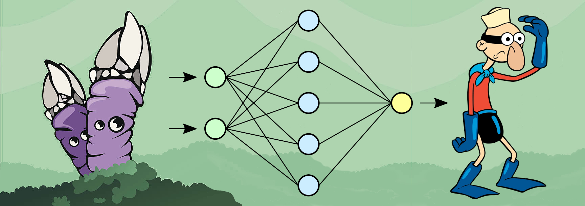

[](https://www.python.org/)
[](https://www.pygame.org/news)


<div style="text-align:left"></div>


# The Barnacle Neuron
### Basic implementation of a Neural Network from scratch

## Table of Contents

- [About this Project](#about-this-project)
    - [Detailed Description](#detailed-description)
    - [Dataset Creation](#dataset-creation)
    - [Neural Network](#neural-network)
    - [Basic Layers](#basic-layers)
    - [MNIST/LETTERS + Training + Result](#entrenamiento)
    - [Interface](#interfaz-grafica)

- [Getting Started](#getting-started)
    - [Installation](#installation)
    - [Usage](#usage)

- [Contact](#contact)

## About This Project

### Detailed Description
We aim to create a complete project from scratch, including the creation of the dataset, the implementation and mathematical derivation of the neural network and the creation of a graphical interface to test the results.

### Dataset Creation
Tocrate the dataset, we've made a pygame interface that allows us to draw letters and numbers and save them as images. 
In order to achive translation, rotation and scaling invariance, we've used data augmentation techniques to expand the dataset.

### Neural Network
We are going to use a modular approach to create the NeuralNetwork class. Abstractly, the neural network will be a list of Layer objects, which will perform two main operations:

1. **Forward Propagation**: Each layer will recieve an input and will calculate the output of the layer, feeding it to the next layer. The exception is the first layer, which will recieve the input from the user.

2. **Backward Propagation**: Each layer $L_{i}$ will recieve the imputed error of the following layer, $L_{i+1}$, that is, the error with respect to the input of $L_{i+1}$, which is the same as the error with respect to the output of the $L_{i}$. The exception is the last layer, which will recieve the imputed error from our loss function.<br>
In this project, we will be using the Log Loss function, which is defined as follows:<br>
$L = -\sum_{c=1}^{My_{o,c}} \log(p_{o,c})$, where $M$ is the number of classes, $y_{o,c}$ is a binary indicator (0 or 1) if class label $c$ is the correct classification for observation $o$, and $p_{o,c}$ is the probability that observation $o$ is classified as class $c$.<br>

### Basic Layers
The Layer class will consist of 3 main methods:
- **__init__**: This method will initialize the layer, depending on the type on layer, it will initialize the weights, the activation function, the kernels, etc.
- **forward**: This method will calculate the output of the layer given an input.
- **backward**: This method will calculate the imputed error of the layer given the imputed error of the next layer. It will also update the parameters of the layer if it is a trainable layer.

This layer will be the base class for the other layers. We will define 2 basic layers for this project: the Dense layer and the Activation layer.  

Now we proceed to define the formulas needed in forward and backward propagation for each layer.  

#### Notation:
- $\bar{X}$: Dataset input (matrix)
- $\bar{Y}$: Dataset output (matrix)

- $\bar{x}$: Input of the layer (vector)
- $\bar{y}$: Output of the layer (vector)

- $\bar{W}$: Weights of the layer (matrix)
- $\bar{b}$: Bias of the layer (vector)
- $\bar{a}$: Activation function of the layer (vector)

- $n$: length of $\bar{x}$
- $m$: length of $\bar{y}$

<br>

We will take advantage of the modular approach of the neural network to define the formulas for each layer.

1. **Dense Layer**

    - **Forward Propagation**:
        $$y_i = w_{i1}x_1 + w_{i2}x_2 + \cdots + w_{in}x_n + b_i = \sum_{j}w_{ij}x_j + b_i$$
        $$\bar{y} = \bar{W}\bar{x} + \bar{b}$$

    - **Backward Propagation**:   
        - **Parameter update**:
            For each weight $w_{ij}$, we have to calculate the partial derivative of the error with respect to that weight. Using the chain rule, we have:
            $$\frac{\partial{E}}{\partial{w_{ij}}} = \frac{\partial{E}}{\partial{\bar{y_i}}} \frac{\partial{\bar{y_i}}}{\partial{w_{ij}}} = \frac{\partial{E}}{\partial{\bar{y_i}}}\bar{x_j}$$
            And for each bias $b_i$:
            $$\frac{\partial{E}}{\partial{b_i}} = \frac{\partial{E}}{\partial{\bar{y_i}}}\frac{\partial{\bar{y_i}}}{\partial{b_i}} = \frac{\partial{E}}{\partial{\bar{y_i}}}\cdot{1}$$
            Extrapolating to matrix notation:
            $$\frac{\partial{E}}{\partial{\bar{W}}} = \frac{\partial{E}}{\partial{\bar{y}}}\bar{x}^T$$
            $$\frac{\partial{E}}{\partial{\bar{b}}} = \frac{\partial{E}}{\partial{\bar{y}}}$$
            Then, we update the weights and the bias using the gradient descent algorithm:
            $$\bar{W} = \bar{W} - \alpha\frac{\partial{E}}{\partial{\bar{W}}}$$
            $$\bar{b} = \bar{b} - \alpha\frac{\partial{E}}{\partial{\bar{b}}}$$
            Where $\alpha$ is the learning rate.
        
        
        - **Imputed Error**:
            This time, since $x_i$ is distributed in all the neurons of the next layer, we have to sum all the partial derivatives of the next layer with respect to $x_i$:
            $$\frac{\partial{E}}{\partial{x_i}} = \sum_{j}\frac{\partial{E}}{\partial{y_j}}\frac{\partial{y_j}}{\partial{x_i}} = \sum_{j}\frac{\partial{E}}{\partial{y_j}}w_{ji}$$
            Extrapolating to matrix notation:
            $$\begin{align}\frac{\partial{E}}{\partial{\bar{x}}}=\begin{bmatrix}\frac{\partial{E}}{\partial{x_1}}\\\frac{\partial{E}}{\partial{x_2}}\\\vdots\\ \frac{\partial{E}}{\partial{x_n}}\end{bmatrix}=\begin{bmatrix}\frac{\partial{E}}{\partial{y_1}}{w_{11}}+\frac{\partial{E}}{\partial{y_1}}{w_{21}}+\cdots+\frac{\partial{E}}{\partial{y_1}}{w_{m1}}\\\frac{\partial{E}}{\partial{y_2}}{w_{12}}+\frac{\partial{E}}{\partial{y_2}}{w_{22}}+\cdots+\frac{\partial{E}}{\partial{y_2}}{w_{m2}}\\\vdots\\\frac{\partial{E}}{\partial{y_m}}{w_{1n}}+\frac{\partial{E}}{\partial{y_m}}{w_{2n}}+\cdots+\frac{\partial{E}}{\partial{y_m}}{w_{mn}}\end{bmatrix}=\begin{bmatrix}w_{11}&w_{21}&\cdots&w_{m1}\\w_{12}&w_{22}&\cdots&w_{m2}\\\vdots&\vdots&\ddots&\vdots\\w_{1n}&w_{2n}&\cdots&w_{mn}\end{bmatrix}\begin{bmatrix}\frac{\partial{E}}{\partial{y_1}}\\\frac{\partial{E}}{\partial{y_2}}\\\vdots\\\frac{\partial{E}}{\partial{y_m}}\end{bmatrix}\end{align}$$

            $$\frac{\partial{E}}{\partial{\bar{x}}} = W^t\frac{\partial{E}}{\partial{\bar{y}}}$$

2. **Activation Layer**
    
    - **Forward Propagation**: 
        $$y_i = a(x_i)$$
        $$\bar{y} = \bar{a}(\bar{x})$$
    - **Backward Propagation**:   
        - **Imputed Error**:
            For each neuron $x_i$, we have to calculate the partial derivative of the error with respect to that neuron. Using the chain rule, we have:
            $$\frac{\partial{E}}{\partial{\bar{x_i}}} = \frac{\partial{E}}{\partial{\bar{y_i}}}\frac{\partial{\bar{y_i}}}{\partial{\bar{x_i}}} = \frac{\partial{E}}{\partial{\bar{y_i}}}a'(\bar{x_i})$$
            Extrapolating to matrix notation:
            $$\frac{\partial{E}}{\partial{\bar{x}}} = \frac{\partial{E}}{\partial{\bar{y}}}\odot{\bar{a}'}$$

## Getting Started
Use the following instructions to get a copy of the project up and running on your local machine.


### Installation
1. Install the required libraries
```
pip install -r requirements.txt
```
2. Clone the repository
```	
git clone https://github.com/pepert03/barnacle-neuron.git
```

### Usage

 - **Dataset Creation**
    1. Run the dataset_ui.py file
    2. Draw a letter or a number
    3. Press the letter or number key to save the image
    4. Repeat the process for all the letters and numbers
    at least 100 images per letter/number.
    5. Press the escape key to exit the program
    6. Run the build_dataset.py file to create the dataset
    feedable to the neural network
    7. (Optional) Run the data_augmentation.py file to
    create more images for the dataset.
    
- **Number / Letters Classification**
    * **GUI**
        1. Run the prediction_ui.py file
        2. Draw a letter or a number
        3. Number / letter will be highlited on the screen
        4. Press 'enter' to clear the screen and draw another
        5. Press the escape key to exit the program
    * **Console**
        1. Run the script predict.py. You can give a path to an image (png or jpg) or a path to a dataset (csv).  
        Arguments:
            - -i, --image: Path to the image to predict
            - -d, --dataset: Path to the dataset to predict
            - -m, --model: Path to the model to use
            - -o, --output: Path to the output file
            - -v, --verbose: Verbose mode  


## Contact

- [José Ridruejo][email-pepe]
- [Sergio Herreros Pérez][email-gomi]


[email-gomi]: mailto:gomimaster1@gmail.com
[email-pepe]: mailto:pepert03@gmail.com
